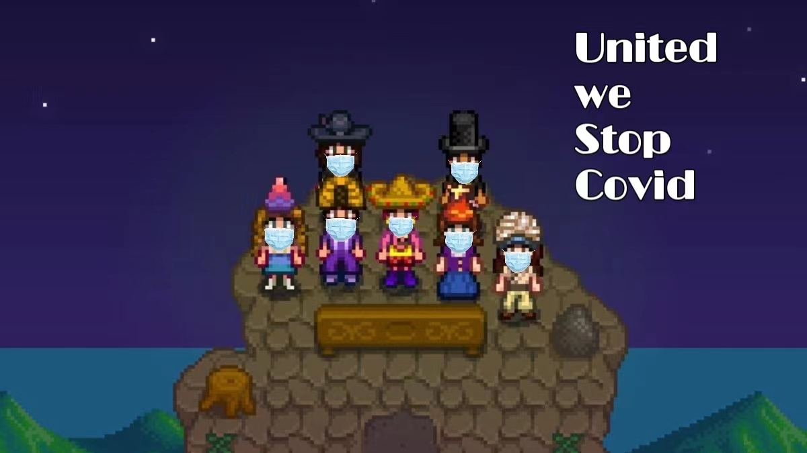

# Athenahacks 2022 - Farm under Pandemic. 

The team members are [Yiming Xie](https://www.linkedin.com/in/yimingx/) and [Shuning Zhang](https://skkkzhang.com/)

Assets from [Cup Nooble](https://cupnooble.itch.io/sprout-lands-asset-pack) and [CraftPix](https://craftpix.net/freebies/free-level-map-pixel-art-assets-pack/)  
UI components from [IDLandGames](https://idlandgames.itch.io/ui-pixelart-assets-8)  
Favicon from [StardewValley](https://stardewvalleywiki.com/File:Steel_Hoe.png)

Before starting the game, please make sure you have installed node.js and have canva enabled on your browser. 

To start the game, first run `node index.js` and then go to `http://127.0.0.1:8125/`.

Enjoy!

